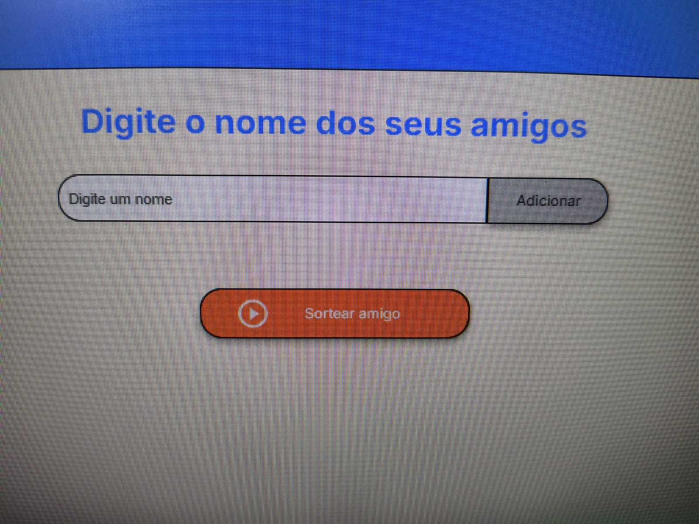
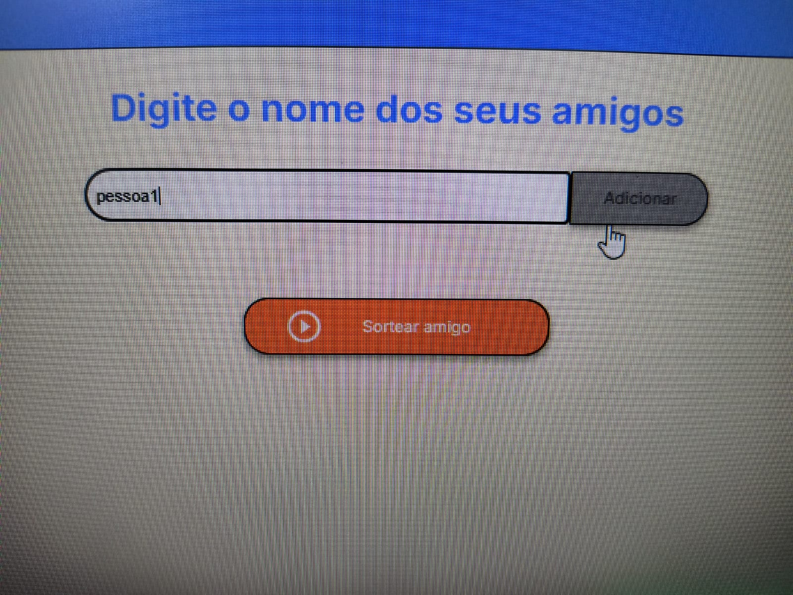
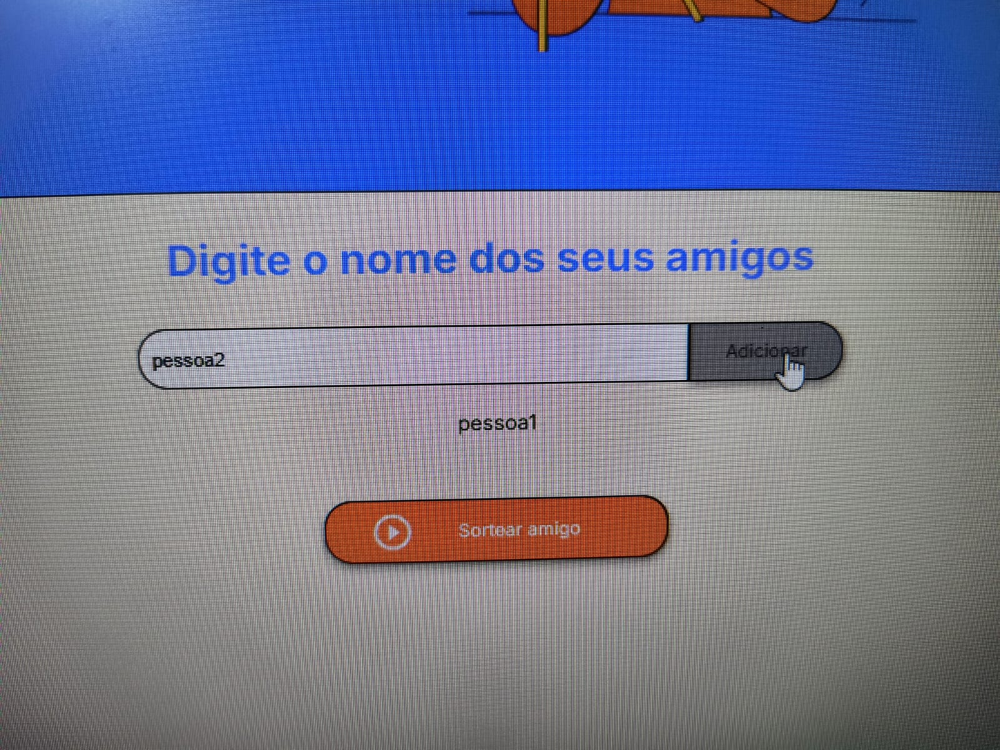
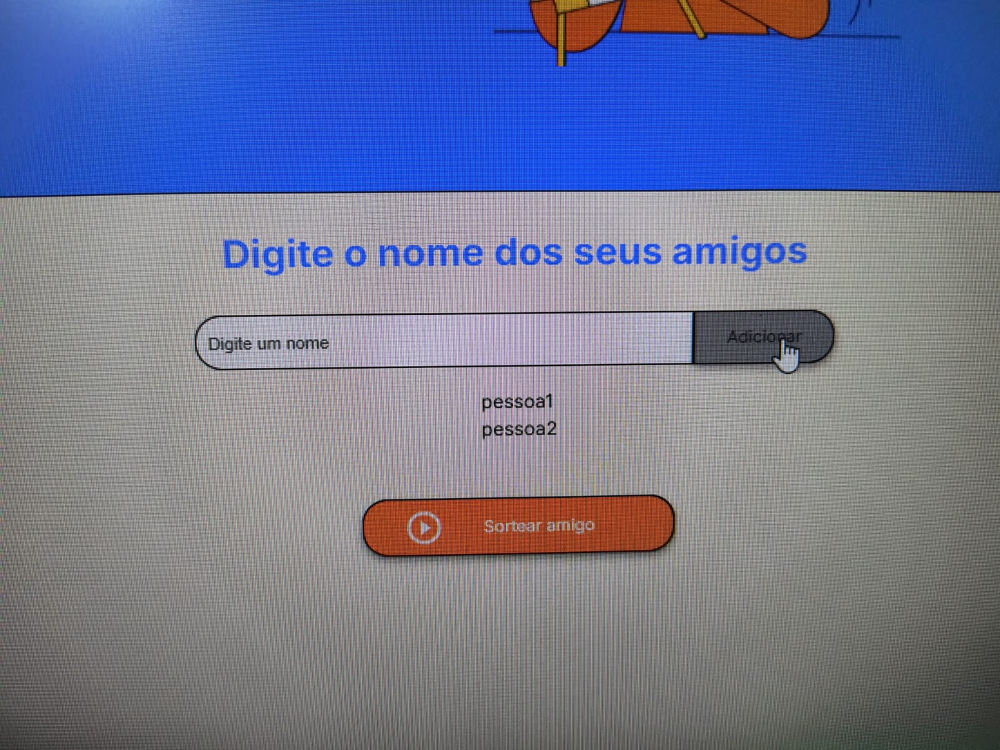
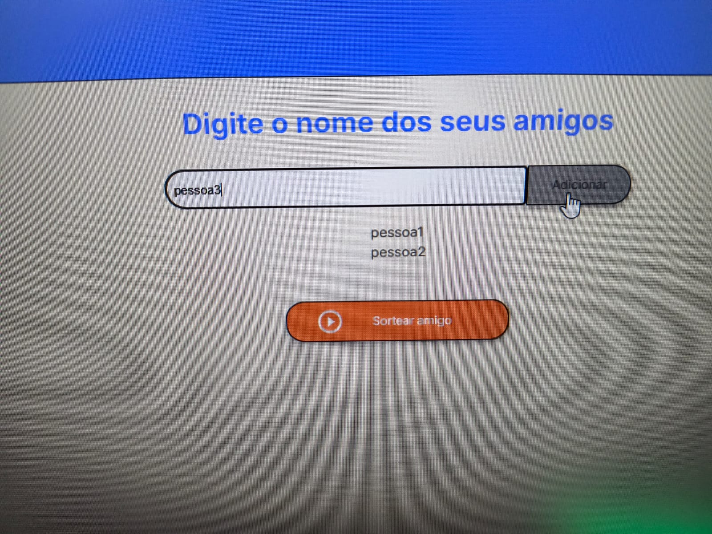
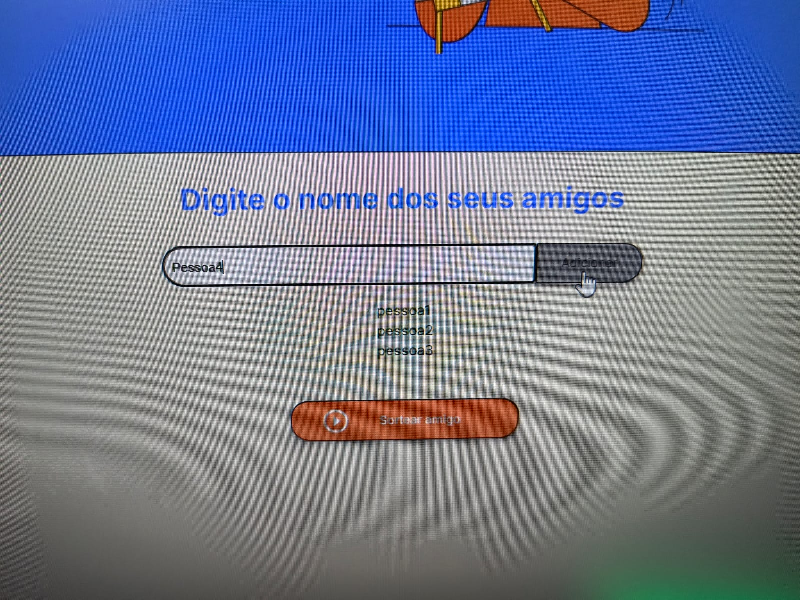
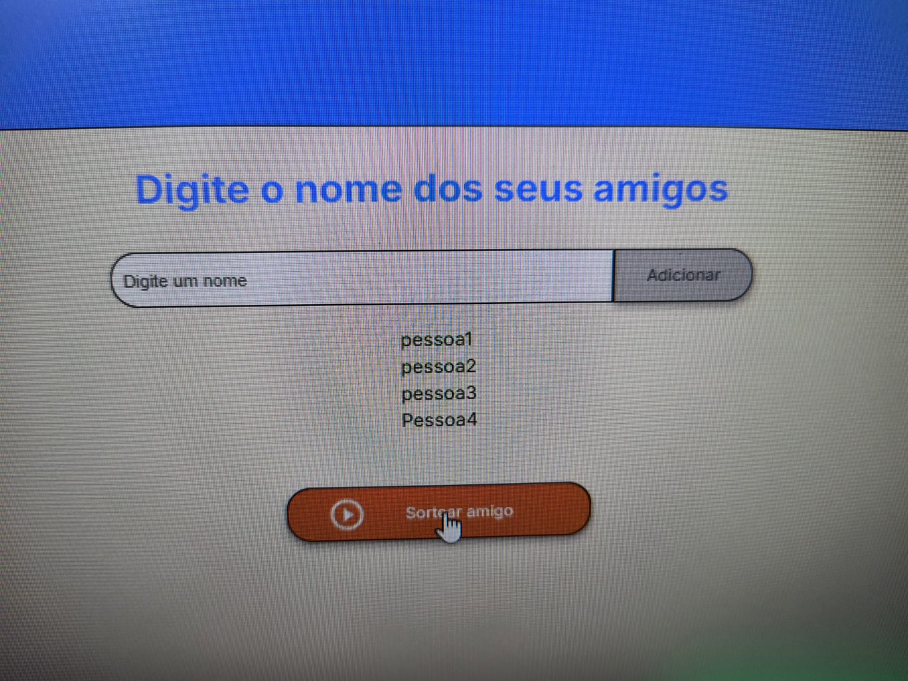
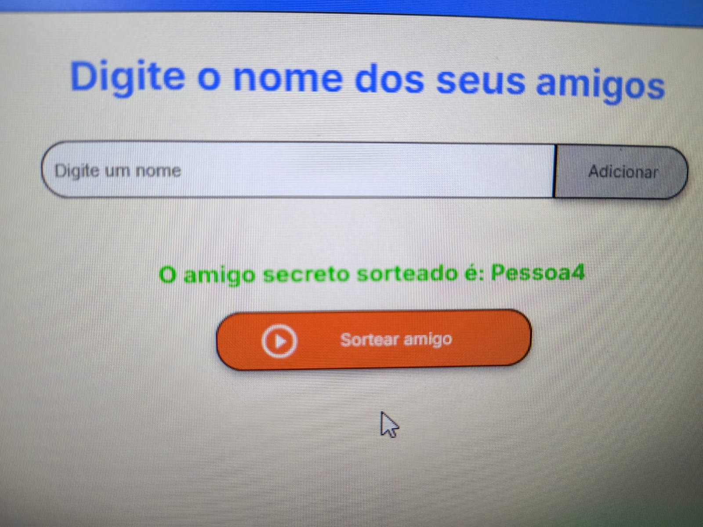

# PROJETO AMIGO SECRETO! 

Meu projeto Amigo Secreto

___________________________________________________________________
## STATUS: Finalizado
___________________________________________________________________

## Tópicos ✅
- <a href="#funcionalidades">Funcionalidades do Projeto</a>
- <a href="#layot">Layout</a>
- <a href="#demonstracao">Demonstração</a>
- <a href="#acesso">Acesso ao Projeto </a>
- <a href="#autor">Autor</a>
- <a href="#linguagem">Linguagem Utilizada</a>

## 📱Funcionalidades do Projeto
- [x] Digitar nome de todos os amigos sendo um de cada vez.

## Layout 

## Demonstração

## Acesso ao projeto
[Projeto](https://github.com/Darlon2/Projeto)

## Autor

[linkedin](https://www.linkedin.com/in/darlonoliveiraa/)

## Linguagem utilizada

1. HTML
2. JAVA SCRIPT
3. CSS

 

